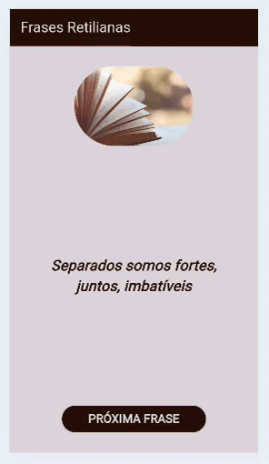

# frase_aleatoria_app
# Frases Retilianas 🦎

<table>
  <tr>
    <td width="300">
      
    </td>
    <td>
      <h3>Sobre o Projeto</h3>
      
Um aplicativo Flutter desenvolvido para gerar frases motivacionais e reflexivas com um design dinâmico e moderno.

      
O app sorteia frases de uma lista personalizada e altera as cores da interface (AppBar e Botão) automaticamente, garantindo sempre o melhor contraste para leitura.

    </td>
  </tr>
</table>

## 🧠 Aprendizados Técnicos
Neste projeto, apliquei conceitos fundamentais de Flutter e Dart:

- **Gerenciamento de Estado**: Uso do `setState` para atualizar a tela sempre que uma nova frase é gerada.
- **Lógica de Programação**: Implementação de sorteio aleatório utilizando a classe `Random()`.
- **UI Responsiva e Layout**: Uso de widgets como `Column`, `Container`, `Spacer` e `Padding` para organizar elementos.
- **Design Avançado**:
    - **Luminância Dinâmica**: Criação de uma função que detecta se a cor de fundo é clara ou escura para ajustar automaticamente a cor do texto, garantindo a leitura (acessibilidade).
    - **Recorte de Elementos**: Uso do `ClipRRect` para arredondar imagens.
    - **Cores Dinâmicas**: Manipulação de cores e opacidade (`withValues`) em tempo real.

## 🎨 Paleta de Cores
O projeto utiliza tons terrosos e neutros:
- #BFB0A3 (Bege Areia)
- #593A27 (Castanho)
- #A67153 (Marrom Médio)
- #260F07 (Marrom Escuro)

## 🛠️ Como rodar o projeto
1. Certifique-se de ter o Flutter instalado.
2. Clone este repositório.
3. Execute `flutter pub get` para baixar as dependências.
4. Rode o comando `flutter run`.
